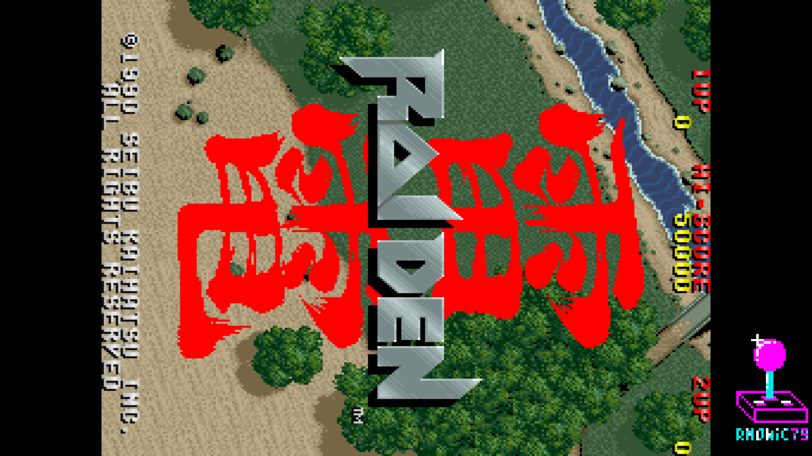
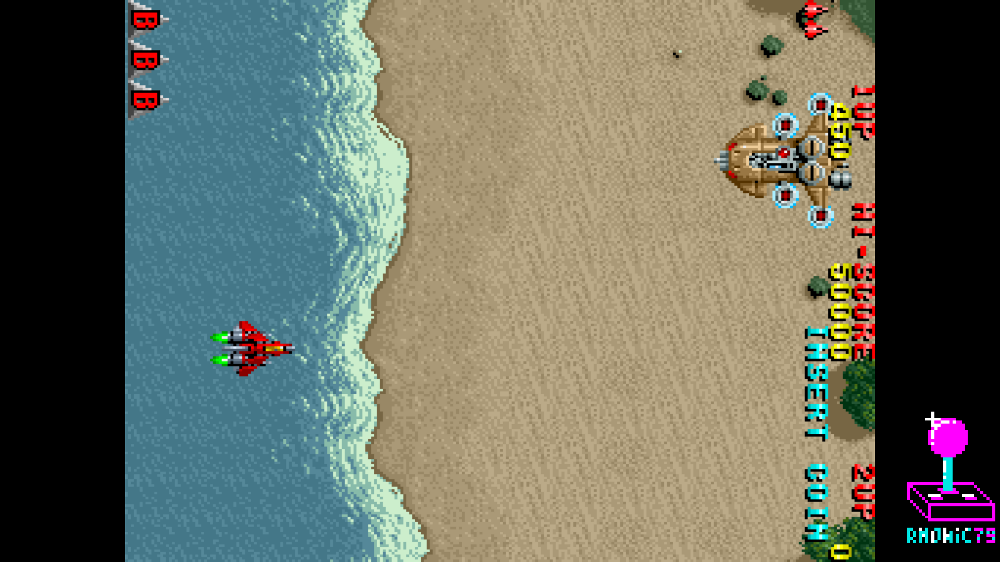
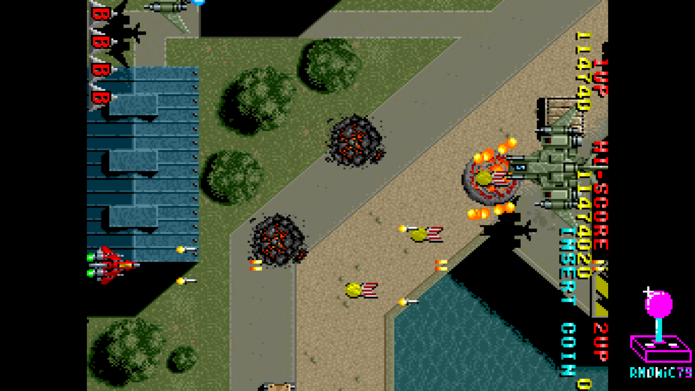
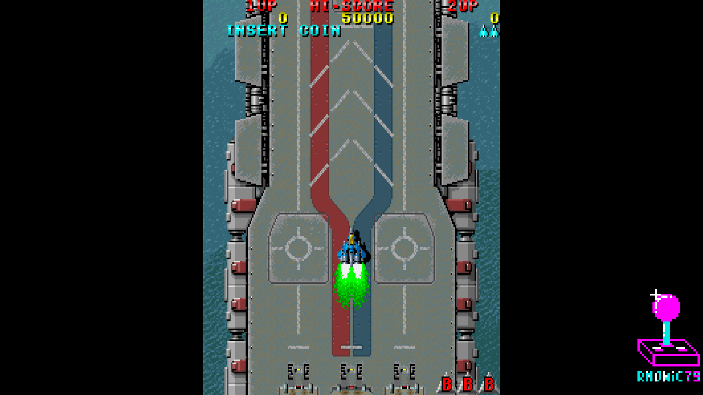
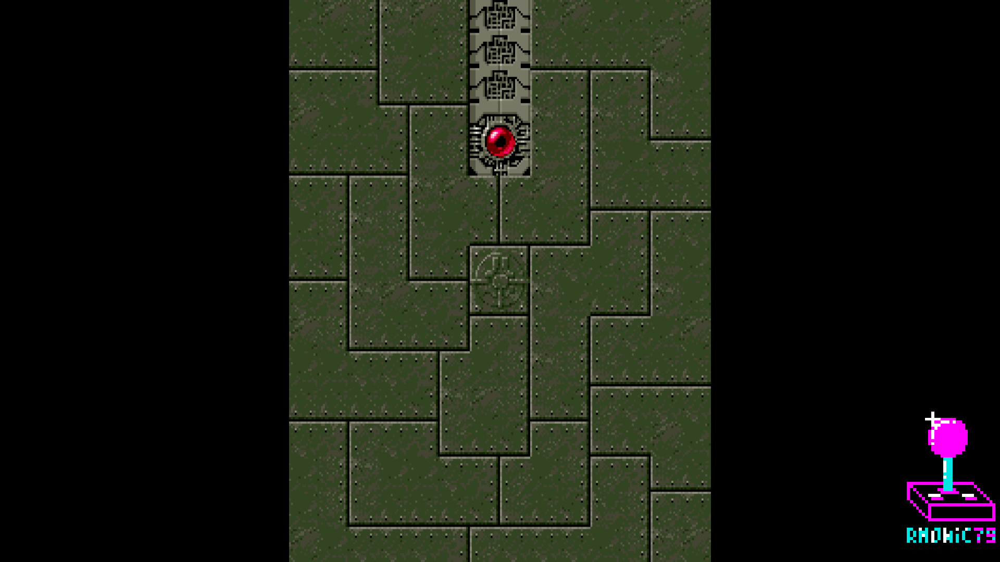
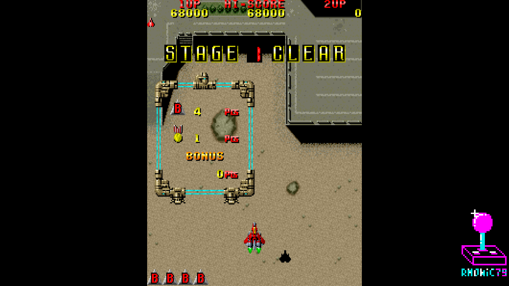
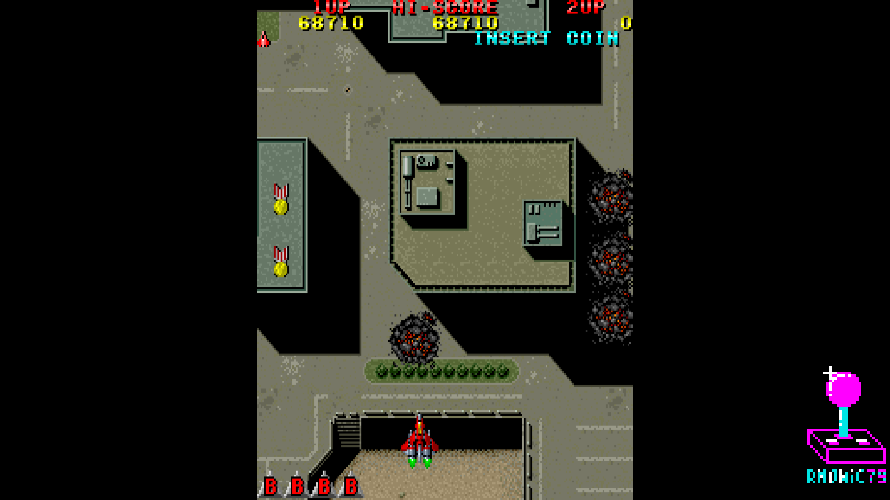
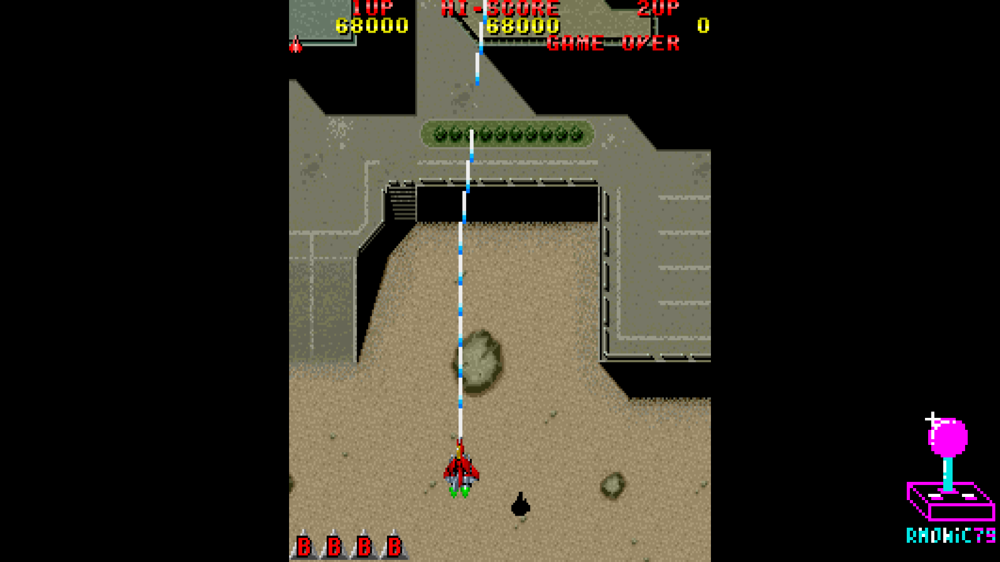

# Arcade-Raiden_MiSTer — Streamer edition

FPGA core for **Raiden** (Seibu Kaihatsu, 1990) targeting the
[MiSTer FPGA](https://github.com/MiSTer-devel) platform (Terasic DE10-Nano).

> ### What this edition is
>
> This is the **Streamer** edition of the Raiden core. The game, the CPUs, the
> video, the audio and the savestates are **identical** to the released core —
> the only difference is *where* the analog geometry stages live.
>
> **What you gain: HDMI stays bit-identical while you fit the picture to a CRT.**
> In the released core the CRT Adjust modules sit inside the core, so the whole
> video path is adjusted and HDMI follows the stretch — which is fine on a CRT,
> but means you cannot have a clean HDMI image and an adjusted analog one at the
> same time. Here `crt_vsize` and `crt_adjust_sys` sit inside `sys_top` on the
> **analog DAC branch only**, and the HDMI scaler taps the stream above them: it
> never sees any of it.
>
> **Why it is not on MiSTer-devel.** Doing this means editing `sys/`, the shared
> framework, and the MiSTer-devel guidelines say the framework must not be
> modified. That rule exists for good reasons, so the **released core stays
> core-side and fully compliant** and lives at
> [Arcade-Raiden_MiSTer](https://github.com/rmonic79/Arcade-Raiden_MiSTer);
> this edition is kept apart, in its own repository, for people who want the
> HDMI output untouched while they dial in a tube. It is not a fork you should
> submit anywhere: it is a deliberate departure.
>
> **Naming, so the two can live together.** The bitstream is
> `Raiden_Streamer.rbf` and the MRA files are prefixed **`rm`** (for *rmonic*) —
> `rm Raiden (World).mra` and so on. Nothing overwrites the standard core: you
> can keep both on the same SD card and the Streamer entries group together in
> the arcade list.
>
> **One extra refinement**, since the read side runs in the framework's video
> domain: the H-Size step here is **0.78 %** instead of 1.56 %.

Raiden runs on **Seibu Kaihatsu hardware** — a vertical arcade board with
two NEC V30 CPUs (main + sub), a Z80 sound CPU, background / foreground
tilemaps, a text layer, a Seibu sprite generator, and YM3812 + OKI M6295
audio driven through the Seibu SEI80BU.

This core reimplements the hardware in SystemVerilog/VHDL from MAME
references and hardware observation.

## About the game

**Raiden** is a vertically scrolling shoot-'em-up: you fly the Raiden
Supersonic Attack Fighter against an alien invasion, alternating between a
spread vulcan cannon and laser while dodging dense enemy fire. Its
solid feel, the trademark bending "Toothpaste" laser and the two-player
co-op made it a coin-op landmark and the start of a long series. The board
runs the game on twin NEC V30 CPUs — a main CPU for game logic and a sub CPU
for video and background work.

## Status

**Current version: 1.8** (August 2026).

The core runs the game end-to-end with video, audio and inputs on real MiSTer
hardware, across all supported ROM sets.

### What changed since 1.0

- **Both V30 CPUs have been replaced with a cycle-exact core.** Main and sub
  now run wickerwaka's **ucore**, a microcode-level V30 validated against real
  silicon, instead of the earlier V30 ported from the R-Type core. This is the
  substantial change of this release: the whole processor is new.
- **New ROM set: Raiden (World set 2, newer hardware)** — the `raidenb`
  revision, with its different memory map, its Seibu CRTC and unencrypted
  program ROMs. It runs from the **same bitstream** as every other set: the MRA
  tells the core which board it is loading, so there is no separate core to
  install.
- **Sprites: about twice the per-line capacity.** The sprite pipeline now reads
  a full tile row in one 64-bit access instead of two 32-bit ones, backed by a
  reorganized DDR3 layout and a 2-way row cache. The drawing logic is unchanged
  and the output is pixel-identical, but the sustainable load per line goes from
  roughly 31 to roughly 64 sprites — so busy scenes hold together where they
  used to drop sprite rows.
- **Savestates: 32 slots**, up from 4, selectable from the OSD and persistent
  across power cycles. Restoring a slot that was never written is now detected
  and ignored, instead of leaving the game in a broken state.
- **CPU Boost** (OSD, default **Off**): runs both CPUs faster than the original
  10 MHz to soften the slowdowns of the busiest scenes. Off by default because
  it is not original behaviour — see *Known issues*.
- **Refresh rate matched to the board.** The default "Original" mode now runs
  **262 lines = 59.63 Hz**, the rate of the real Raiden PCB; the previous
  release used a slightly different figure. A **60 Hz** option remains for
  fixed-rate displays.
- **Flip Screen fixed.** With the DIP set to flip, the picture is centred
  exactly as it is unflipped, and the sprite / background desync that could
  appear in that mode is gone — the fix is structural, so it holds regardless
  of how fast the CPUs run.
- **CRT Adjust brought up to the current module, and CRT V-Size added.** The
  core now uses the released
  [CRT Adjust](https://github.com/rmonic79/MiSTer-CRT-Adjust) modules
  (`crt_adjust.sv` + `crt_vsize.sv`) instead of the older stretch-only one, so
  it gains **vertical size** on top of H-Size, H-Position and V-Shift, all
  behind a single **On / Off** switch that hides the controls and bypasses the
  chain entirely when Off. See *CRT Adjust* below.
- **Audio rework, with a per-channel mixer.** Independent level control for
  **each of the nine YM3812 channels** and **each of the four OKI M6295
  channels**, from the Audio page in the OSD.
- **Audio filter baked in.** The arcade low-pass curve that matches recordings
  from the real board is part of the core, so it applies out of the box with no
  external filter file. OSD entry **Audio Filter**, On by default.
- **The sound clock is now exact.** The Z80 and the YM3812 share a 3.579545 MHz
  clock that does not divide evenly from the core's 80 MHz, and the integer
  divider used until now ran them at 3.636 MHz — 1.58% fast, which is a quarter
  of a semitone sharp and a music tempo that runs ahead of the board. A
  fractional clock enable brings the average to 3.5796 MHz, within 0.0004% of
  the real rate, so pitch and tempo now match the arcade.
- **Gamma correction now works.** The core drives its video output directly
  rather than through the framework's video mixer, where gamma normally lives,
  so the OSD entry existed but was connected to nothing.
- **Rotation no longer affects the analog output.** Enabling TATE used to
  reroute the analog signal through the scaler; the analog CRT path now stays
  untouched, while HDMI rotation keeps going through the framebuffer.

## Known issues

- **Slowdowns when the screen gets busy.** The board itself slows down in dense
  scenes: the sub CPU saturates while the main CPU waits for it, and the core
  reproduces that at the original 10 MHz. **CPU Boost** shortens the slowdowns
  but does not remove them — with a full sprite list the work still exceeds one
  frame — and it is not original behaviour, so it is Off by default.
- **CRT Adjust does not touch HDMI in this edition** — that is what it is for.
  The stages sit on the analog DAC branch and the scaler taps above them, so the
  HDMI picture stays bit-identical at every setting.
- **CRT V-Size is experimental.** *PVM* mode moves the HSync (~0.4 % per line),
  so how far it goes depends on the monitor's horizontal lock — broadcast
  monitors follow it, arcade chassis usually refuse it. (V-Shift stays exact at
  any V-Size setting here: the frame length is measured every frame instead of
  being assumed.) *Cabinet* mode cannot
  desync anything by construction; its cost is a very slight, uniform vertical
  softness. Leave V-Size at `0` for a bit-identical picture.
- **Large negative H-Position values can show a black band at one edge.** The
  control slides the content inside the line buffer, and Raiden's active area
  (256 px in a 320 px line) sits close to one margin, so pushing it far enough
  runs it out of the window. The small values used for centring are unaffected.
- **Savestate files are 1.75 MB each.** The MiSTer firmware handles four
  savestate files, so the 32 slots are packed eight per file, and each file is
  written whole whatever slot changed.

## Features

- Two NEC V30 main/sub CPUs @ 10 MHz, cycle-exact (wickerwaka's ucore) —
  encrypted opcodes decrypted on board during ROM download (no pre-decrypted
  ROMs needed)
- Z80 sound CPU (T80) with the Seibu SEI80BU sound interface
- Background + Foreground tilemaps and a text layer
- Sprite renderer with priority and flip, 64-bit row fetch and row cache
- Audio: YM3812 (OPL2, jtopl) + OKI M6295 ADPCM (jt6295), per-channel mixer and
  built-in arcade audio filter
- Tile ROM streaming through SDRAM; sprite ROM and ADPCM ROM backed by DDR3
- **32 savestate slots**, selectable from the OSD, persistent across power cycles
- **CPU Boost** (Off by default) for the busiest scenes
- **Refresh Rate**: Original 59.6 Hz (board-accurate) or 60 Hz
- TATE / vertical rotation support, with the analog path left untouched
- VBlank-synchronized pause (frame-aligned, no race conditions)
- **CRT Adjust**: H-Size, H-Position, V-Shift and **V-Size** (PVM / Cabinet),
  grouped behind a single On / Off switch
- **Player 1P / 2P** selector — play solo as player 2 with a single pad
- MiSTer OSD with video and DIP options

## ROM sets supported

- Raiden (`raiden`, World set 1) — parent
- Raiden (`raidenb`, World set 2, newer hardware)
- Raiden (Japan)
- Raiden (USA, Fabtek)
- Raiden (Taiwan)
- Raiden (Korea)

All sets run from the same bitstream. The *newer hardware* revision is a
genuinely different board — different memory map, Seibu CRTC, unencrypted
program ROMs — and the MRA tells the core which one it is loading, so there is
nothing extra to install.

### The V30 CPU

From 1.8 the core runs **ucore**, Martin Donlon's cycle-exact NEC V30: a
microcode-level reimplementation validated against real V30 silicon, rather
than a behavioural model. Both the main and the sub CPU use it.

While bringing the core over, a defect was found in the interaction between
repeated string instructions and interrupts — a `REP` prefixed instruction that
terminated on its own condition in the same cycle an interrupt arrived could
lose the result. It was reported upstream with a reproducer and **fixed in
ucore itself**, so every core using it benefits.

### Sprites

The sprite path was rebuilt around the memory access rather than the drawing
logic, which is unchanged and produces pixel-identical output. Each 16-pixel
tile row lives as one contiguous 64-bit word in DDR3, reorganized while the ROM
is downloaded, so a row costs one access instead of two, and a small 2-way
cache keeps the rows a busy line reuses. On the bench the sustainable load per
line moved from roughly 31 sprites to roughly 64.

### CRT Adjust — the analog geometry module (here: sys-side)

**CRT Adjust** is my own module, released standalone and shared by several of
my cores:

- Repository: [MiSTer-CRT-Adjust](https://github.com/rmonic79/MiSTer-CRT-Adjust)

From one always-on line buffer it gives live controls in the OSD, all hidden
behind a single **CRT Adjust** On / Off switch:

- **H-Size** — horizontal stretch / squeeze, bidirectional and integer
- **H-Position** — horizontal image shift
- **V-Shift** — vertical line shift
- **V-Size** — vertical stretch / shrink (see below)

Raiden slides the **content** inside the line buffer and leaves the HSync
byte-for-byte native, so the horizontal controls cannot desync anything. The
stretch is integer and line-buffered: each source pixel is held for a whole
number of pixel-clock periods, so there is **no shimmering, no blending and no
scaling artifact** on the analog output.

In this edition the stages are wired **inside `sys_top`, on the analog DAC
branch only**: the HDMI scaler taps the video stream above the insertion point,
so **HDMI stays bit-identical** no matter how you set H-Size, H-Position,
V-Shift or V-Size. That is the whole point of the Streamer edition — and the
reason it cannot be published under MiSTer-devel, whose guidelines forbid
touching `sys/`. The released core does the same job core-side, where HDMI
follows the adjust and you leave the option Off for a clean HDMI image.

The core itself only decodes the OSD values and exports them (`CRT_ON`,
`CRT_HSIZE`, `CRT_HPOS`, `CRT_VSHIFT`, `CRT_VSIZE`, `CRT_VSMODE`) together with
the true native VBlank; the picture leaving the core is untouched.

### CRT V-Size (experimental)

**V-Size** is the vertical companion. One OSD step is three lines, "+" makes
the picture taller.

The frame rate cannot change — the game dictates it — so the height is changed
in one of two **exclusive** ways, selected from the OSD:

| | **PVM** — line retimer | **Cabinet** — photometric |
|---|---|---|
| Mechanism | retimes the total line count per frame: every line stays **unique**, zero artifacts — the vertical twin of H-Size | timing stays 100 % native: each source line's light is redistributed onto the fixed scanline grid (gamma-correct, energy-preserving) |
| HSync | moves ~0.4 % per line | untouched to the Hz — losing sync is physically impossible |
| Use on | broadcast monitors with a wide horizontal lock | arcade chassis, consumer TVs, anything that refuses frequency changes |
| Cost | the monitor must follow the frequency | a very slight, uniform vertical softness |

Raiden needs very little vertical correction on a well set-up monitor, so the
few steps that matter are usually within what **PVM** mode can do — which keeps
the picture pixel-exact. With V-Size at `0` the stage bypasses entirely and the
image is bit-identical to the untouched core.

Marked **experimental** — see *Known issues*.

## Screenshots

**Vertical (TATE)**

| | |
|---|---|
|  |  |
| Logo | Gameplay |
|  | |
| Gameplay | |

**Landscape**

| | |
|---|---|
|  |  |
| Two-player co-op | Fade |
|  |  |
| Gameplay | Gameplay |
|  | |
| Gameplay | |

## Hardware emulated

| Component        | Spec                                                |
|------------------|-----------------------------------------------------|
| Main CPU         | NEC V30 @ 10 MHz, cycle-exact (encrypted opcodes)   |
| Sub CPU          | NEC V30 @ 10 MHz, cycle-exact (encrypted opcodes)   |
| Sound CPU        | Zilog Z80 (T80)                                     |
| Sound chip 1     | Yamaha YM3812 OPL2 (jtopl)                          |
| Sound chip 2     | OKI M6295 ADPCM (jt6295)                            |
| Sound interface  | Seibu SEI80BU                                       |
| Video            | Background + Foreground tilemaps + text layer       |
| Sprites          | Seibu sprite generator                              |
| Video timing     | 256×224 active, 262 lines, 59.63 Hz                 |

## Hardware requirements

- Terasic DE10-Nano
- MiSTer I/O board (recommended)
- SDRAM module (32 MB or 64 MB)
- DDR3 memory (built into DE10-Nano, used for sprite ROM and OKI ADPCM ROM)
- Works on HDMI displays and on CRTs via the analog video output

## Building from source

Requires Quartus Prime 17.0 (free Lite Edition).

```
Open Raiden_Streamer.qpf in Quartus → Processing → Start Compilation
```

Output bitstream is generated in `output_files/Raiden_Streamer.rbf`.

## Running on MiSTer

The [releases/](releases/) folder contains the MRA files and a prebuilt RBF:

- `Raiden (World).mra` — parent MRA
- `releases/_alternatives/` — MRAs for the other sets (World set 2 newer
  hardware, Japan, US, Taiwan, Korea)
- `Raiden_YYYYMMDD.rbf` — prebuilt bitstream

Steps:

1. Copy `Raiden_Streamer.rbf` to `_Arcade/cores/` on the MiSTer SD card (or keep
   the dated name and update the MRA accordingly). It does **not** overwrite the
   standard core, so both can coexist.
2. Copy the `rm ...mra` files to `_Arcade/` on the MiSTer SD card (alternates in
   `_Arcade/_alternatives/`). They are prefixed `rm` so they group together in
   the arcade list and stay distinct from the standard entries.
3. Provide your legally-owned ROM files where the MRA expects them
   (usually in `games/mame/`). The *newer hardware* MRA expects a **merged**
   romset, with that revision's own ROMs in the `raidenb/` subfolder.

**ROMs are NOT included in this repository.** You must provide them yourself.

## Repository layout

```
Arcade-Raiden_MiSTer/
├── rtl/
│   ├── Raiden/      Raiden-specific core RTL (buses, tilemaps, sprites,
│   │   │            shared RAM, decrypt, Seibu CRTC, audio glue,
│   │   │            crt_adjust.sv + crt_vsize.sv)
│   │   ├── v30/     previous NEC V30 CPU core (kept for reference)
│   │   └── v30_new/ bus adapter for the cycle-exact V30
│   ├── ucore/       NEC V30 cycle-exact CPU core (wickerwaka)
│   ├── common/      shared logic: savestate, DDR gate, bridges
│   ├── jtframe/     JTFRAME framework modules
│   ├── sound/       jtopl (YM3812), jt6295 (OKI M6295), t80 (Z80), mixer
│   ├── pll/         Clock PLL
│   └── sdram.sv     SDRAM controller (Sorgelig)
├── sys/             MiSTer framework (Sorgelig / MiSTer-devel) — MODIFIED here:
│                    crt_adjust_sys.sv + crt_vsize.sv on the analog branch
├── logo/            OSD overlay assets
├── docs/            In-game screenshots
├── releases/        MRA files + prebuilt RBF
├── Raiden_Streamer.qpf  Quartus project
├── Raiden_Streamer.qsf  Quartus assignments
├── Raiden.sv        Top-level core wrapper
├── Template.sdc     Timing constraints
├── files.qip        HDL file list
└── README.md        This file
```

## Acknowledgements

- **Martin Donlon** ([wickerwaka](https://github.com/wickerwaka)) for the
  **cycle-exact NEC V30** CPU core used from 1.8 onwards, from his
  [`nec_test`](https://github.com/wickerwaka/nec_test) project — a
  microcode-level reimplementation validated against real V30 silicon.
- **Martin Donlon** ([wickerwaka](https://github.com/wickerwaka)) for the
  earlier **NEC V30** CPU core, taken (and modified) from his R-Type MiSTer
  core, used up to 1.0 and still in the tree as a reference — original
  WonderSwan V30 by **Robert Peip**
  ([@RobertPeip](https://github.com/RobertPeip), FPGAzumSpass).
- **Martin Donlon** ([wickerwaka](https://github.com/wickerwaka)) for the
  savestate infrastructure.
- **Jose Tejada** ([@jotego](https://github.com/jotego)) for JTOPL (YM3812),
  JT6295 (OKI M6295) and the JTFRAME framework.
- **Andrea Bogazzi** ([@asturur](https://github.com/asturur)) for the work on
  the CRT Adjust module.
- **Daniel Wallner** for the **T80** Z80 CPU core.
- The **MAMEDev team** for the invaluable reference on the Seibu hardware,
  memory maps, ROM decryption and timing.
- **Sorgelig** and the **MiSTer-devel team** for the framework, SDRAM
  controller and Template.

## Support this project

If you enjoy this core and want to support its development:

- [Ko-fi](https://ko-fi.com/ibecerivideoludici) — one-time support
- [Patreon](https://www.patreon.com/IBeceriVideoludici) — monthly support
- [PayPal](https://www.paypal.me/IBeceriVideoludici) — one-time donation

## Follow

- [GitHub](https://github.com/rmonic79)
- [Twitch](https://twitch.tv/ibecerivideoludici) — live streams
- [YouTube](https://www.youtube.com/c/IBeceriVideoludici) — playlists and videos
- [X / Twitter](https://x.com/rmonic79)

## License

The RTL source code in this repository is provided as-is for educational
and preservation purposes under **GNU GPL v3 or later**. Original ROM data
is not included; users must provide their own legally obtained copies.

Original *Raiden* arcade hardware © Seibu Kaihatsu, 1990.
